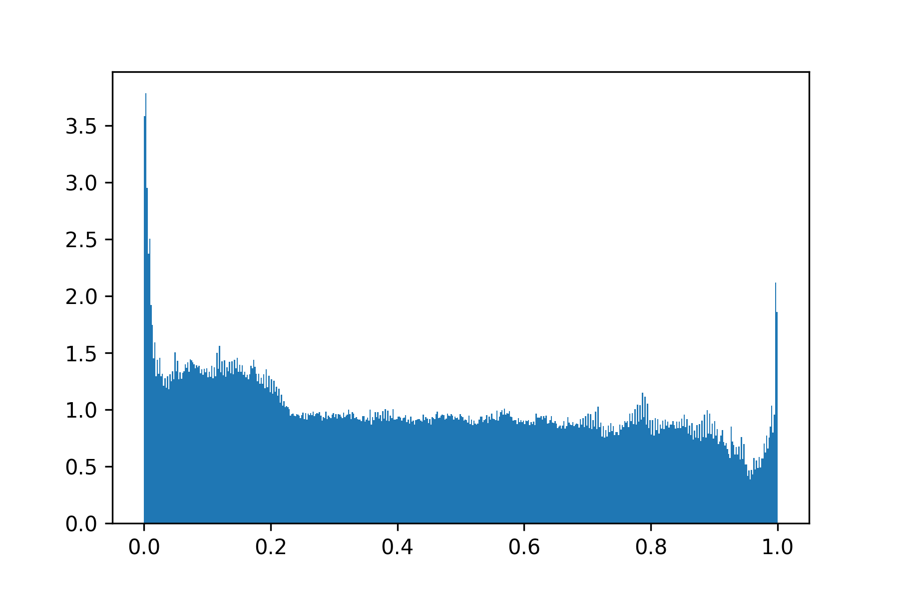

# Generating Faces

Nous avons traité les images avec skimage en appliquant un bruit $Uniform(0,1)$
et un rescaling entre $[0, 1]$ afin de pouvoir considérer les canaux comme des
probabilités d'émission.

Nous remarquons un léger biais vers les valeurs de saturation des canaux
\ref{figure:1}, ce qui est expliqué par des régions particulièrement sombre des
images.

# Model

Nous avons implanté l'auto-encodeur variationel.

Pour reconstruire des images de bonne qualité, nous nous sommes inspirés de
l'architecture et des techniques utilisés pour DCGAN [@http://zotero.org/users/3733213/items/3WJPTN3T].
En particulier, nous avons utilisé une activation sigmoïde pour reconstruire le
spectre RGB du générateur normalisé sur l'intervalle $[0, 1]$.

Couche Détails
------ -------
conv2d 128  kernel $5 \times 5$ strides 2
conv2d 256  kernel $5 \times 5$ strides 2
conv2d 512  kernel $5 \times 5$ strides 2
conv2d 1024 kernel $5 \times 5$ strides 2
flatten

: Architecture de l'encodeur \label{table:1}

Toutes les convolution de la table \ref{table:1} utilisent la normalisation par
lot et une activation LeakyReLU.

Le décodeur possède l'architecture générale suivante:

Couche     Détails
------     -------
dense      $W_{100 \times 16 384} + b_{16 384}$
reshape    $16 384 \rightarrow 16 \times 16 \times 64$
<<<<<<< HEAD
upscaling  implementation-dependant
deconv2d   32 kernel $3 \times 3$
upscaling  implementation-dependant
deconv2d   32 kernel $3 \times 3$

: Architecture du décodeur

 Nous avons empilé 2 convolutions avec 1 max pooling.

 Nous avons également essayé la normalisation par lot pour accélérer
 l'entraînement, mais avons noté que cette approche avait tendance à corrompre
 les images produites par le décodeur.

=======
upsampling dépend de l'implémentation
deconv2d   32 kernel $3 times 3$
upsampling dépend de l'implémentation
deconv2d   3 kernel $3 \times 3$

: Architecture du décodeur

L'upsampling utilisé dépend du type de décodeur:

 - déconvolution striée avec kernel $3 \times 3$ strides 2
 - interpolation du plus-proche-voisin avec facteur 2 et déconvolution 2d avec
 kernel $3 \times 3$
 - interpolation bilinéaire avec facteur 2 et déconvolution 2d avec
 kernel $3 \times 3$

Nous avons également essayé la normalisation par lot pour accélérer
l'entraînement, mais avons noté que cette approche avait tendance à corrompre
les images produites par le décodeur. Par conséquent, nous l'avons seulement
appliqué sur l'encodeur.
>>>>>>> 17ef574d0280117c9589a7a29d01696a0ad6223b

 Pour la déviation standard du postérieur, la sortie de l'encodeur correspond à son logarithme. Cela permet de s'assurer que la déviation standard est positive, et d'assurer un a priori uniforme sur le logarithme (a priori de Jeffrey pour un paramètre d'échelle). Ainsi:
$$
 \log \sigma(z) = W_\sigma h + b,\\
 \mu(z) = W_\mu h + b.
$$

## 3. Comparaison des architectures

L'upscaling utilisé dépend du type de décodeur. Nous avons comparé les trois approches suivantes:

 - déconvolutions striées
 - upsampling par le plus proche voisin
 - upsampling par interpolation bilinéaire

Nous avons intégré l'interpolation du plus proche voisin[^resize_neighbor] et
bilinéaire[^resize_bilinear] de Tensorflow. La déconvolution striée était déjà
implémentée dans Keras.

[^resize_nearest]: https://www.tensorflow.org/api_docs/python/tf/image/resize_nearest
[^resize_bilinear]: https://www.tensorflow.org/api_docs/python/tf/image/resize_bilinear

Les trois modèles ont été entraînés sur l'ensemble d'entraînement avec un split de 33% pour la validation.

Résultats:
INSERER IMAGES DE RECONSTRUCTION

 - déconvolution striée avec kernel $3 \times 3$ strides 2

 - interpolation du plus-proche-voisin avec facteur 2

 - interpolation bilinéaire avec facteur 2

Le modèle XXX a été conservé pour l'évaluation des images générées.

## 4. Variantes

IWAE: 5 importance samples.

## 5. Évaluation qualitative

### (a) Échantillons visuels
INSERER ECHANTILLONS: VAE vs IWAE

Le IWAE fait mieux que le VAE vanille (moins flou, plus de diversité)?

Pourquoi? Plus $k$ (importance samples #) est grand, plus le variational gap est petit. Aussi, la variance de l'estimation de la ELBO diminue avec $k$. Une grande valeur de $k$ facilite la convergence.

### (b) Taille de l'espace latent
Les changements de taille de l'espace latent influencent-ils beaucoup le modèle?

Augmenter la taille de l'espace latent peut être utile si le modèle possède une capacité suffisante.

### (c) Interpolation dans l'espace latent
Interpolation dans $z$ vs interpolation dans $x$.

Les échantillons interpolés dans $z$ donnent des images plus réalistes que les échantillons interpolés dans $x$. En effet, le support de $z$ correspond à un manifold dans l'espace de $x$, et le VAE cherche à faire correspondre à chaque point de l'espace latent un point possédant une probabilité non négligeable dans l'espace de $x$. Par contre, au sein de ce dernier, les images interpolées entre 2 points peuvent être très loin de la vraie distribution des $x$.

## 7. Évaluation quantitative (VAE)
K=2000

D = 64 x 64 x 3

$bpp = \frac{\log p(x)}{\log 2 \times D}$
