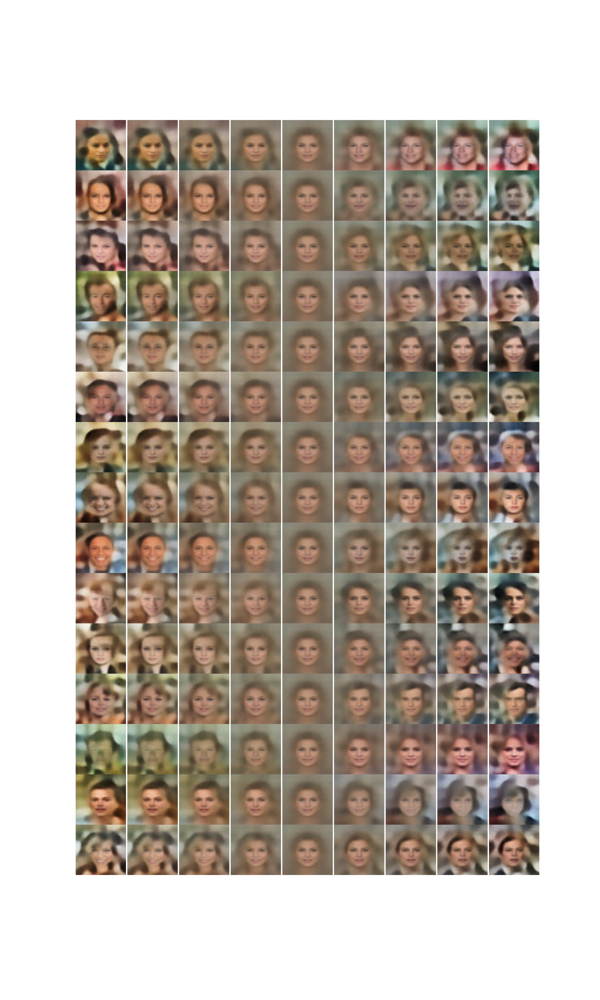

# Générer des visages

Nous avons traité les images avec skimage en appliquant un bruit $Uniform(0,1)$
et une normalisation sur 256.

Nous remarquons un léger biais vers les valeurs de saturation des canaux
\ref{figure:1}, ce qui est expliqué par des régions particulièrement sombres et
claires des images.

# Modèle

Nous avons implanté l'auto-encodeur variationel.

Pour reconstruire des images de bonne qualité, nous nous sommes inspirés de
l'architecture utilisée par Deep Feature Consistent Variational Autoencoder [@http://zotero.org/users/3733213/items/H5F7HPGA].
En particulier, nous avons utilisé une activation sigmoïde pour reconstruire le
spectre RGB du générateur normalisé sur l'intervalle $[0, 1]$, de la
normalisation par lot et des activations LeakyReLU.

Couche  Détails
------  -------
conv2d  32 kernel $4 \times 4$ strides 2
conv2d  64 kernel $4 \times 4$ strides 2
conv2d  128 kernel $4 \times 4$ strides 2
conv2d  256 kernel $4 \times 4$ strides 2
flatten 4096 unités

: Architecture de l'encodeur \label{table:1}

Toutes les convolution de la table \ref{table:1} utilisent la normalisation par
lot et une activation LeakyReLU.

Le décodeur possède l'architecture générale suivante:

Couche     Détails
------     -------
dense      4096 unités
reshape    $4096 \rightarrow 256 \times 4 \times 4$
upsampling dépend de l'implémentation
conv2d     128 kernel $3 \times 3$
upsampling dépend de l'implémentation
conv2d     64 kernel $3 \times 3$
upsampling dépend de l'implémentation
conv2d     32 kernel $3 \times 3$
upsampling dépend de l'implémentation
conv2d     3 kernel $3 \times 3$ avec activation sigmoïde

: Architecture du décodeur

Toutes les convolutions du décodeur, à l'exception de la dernière, utilise la
normalisation par lot et une activation LeakyReLU.

L'upsampling utilisé dépend du type de décodeur:

 - déconvolution striée avec kernel $3 \times 3$ strides 2
 - interpolation du plus-proche-voisin avec facteur 2
 - interpolation bilinéaire avec facteur 2

Les implémentations pour les interpolations[^resize_nearest][^resize_bilinear]
sont fournies nativement par Tensorflow[@http://zotero.org/users/3733213/items/J2JKPUPS].

[^resize_nearest]: https://www.tensorflow.org/api_docs/python/tf/image/resize_nearest
[^resize_bilinear]: https://www.tensorflow.org/api_docs/python/tf/image/resize_bilinear

Nous avons remarqué un gain majeur de l'utilisation de la normalisation par lot
autant au niveau de l'encodeur et du décodeur.

Pour la déviation standard du postérieur $q(z \mid x; \mu, \sigma)$, la sortie
de l'encodeur correspond à son logarithme. Cela permet de s'assurer que la
déviation standard est positive, et d'assurer un a priori uniforme sur le
logarithme (a priori de Jeffrey pour un paramètre d'échelle). Ainsi:

$$
\log \sigma(z) = W_\sigma h + b,\\
\mu(z) = W_\mu h + b.
$$

Dans tous les modèles, nous avons minimisé la perte $L^2$ à l'échelle du nombre
de dimensions de l'image avec une pénalité Kullback-Leibler suivant une
gaussienne isotropique sur l'espace latent.

# Comparaison des architectures

Les trois modèles ont été entraînés sur 1000 exemplaires de l'ensemble
d'entraînement pour juger de la qualité des reconstructions.

La déconvolution est l'opération inverse de la convolution, tandis que le suréchantillonnage par le plus-proche-voisin et le suréchantillonnage bilinéaire sont des méthodes d'interpolation.

L'interpolation a pour effet de reconstituer des images plus floues, puisque
des valeurs proches sont assignées à des pixels proches spatialement.
L'interpolation bilinéaire a notamment un effet de *smoothing* bien marqué,
mais aucune des deux méthodes d'interpolation ne permet de reconstruire les
détails fins.

On remarque que la déconvolution striée (voir figure \ref{figure:2}) donne les
meilleurs résultats, avec davantage de détails.

On note que la pénalisation Kullback-Leibler est bien appliquée dans la figure
\ref{figure:3}. La divergence par rapport à la normale est dû au petit nombre
d'époques d'entraînement.

L'architecture avec la déconvolution a été conservée pour les analyses suivantes.

# Variantes

Nous avons implanté le *Importance Weighted Autoencoder* avec $k=5$.

# Évaluation qualitative

## (a) Échantillons visuels

L'IWAE reconstruit beaucoup mieux les images que le VAE classique. On remarque
en particulier que les détails fins comme les cheveux sont mieux reportés dans
les exemplaires reconstruits. De plus, les contrastes des images originales
sont mieux reproduits par l'IWAE: les couleurs claires sont plus claires, et
les couleurs sombres, plus sombres.

Plus $k$ (importance samples #) est grand, plus le variational gap est petit:
la borne inférieure de l'évidence (ELBO) est plus proche de l'évidence lorsque
$k>1$, i.e. l'approximation de la borne inférieure de l'évidence par l'IWAE est
moins biaisée que celle du VAE.

De plus, la variance de l'estimation de la ELBO diminue avec $k$, ce qui
explique qu'une grande valeur de $k$ facilite la convergence. En effet, nous
avons remarqué que même si l'IWAE est plus coûteux à entraîner (environ 2 fois
plus de temps par exemplaire), sa perte converge beaucoup plus rapidement que
celle du VAE.

## (b) Taille de l'espace latent

Les images de chaque ligne de la figure ci-dessus sont données par la variation
linéaire d'une variable de l'espace latent entre $[-3, 3]$ déviations standard,
pendant que toutes les autres variables sont tenues égales à 0.

Au centre de l'espace latent, on trouve une image contenant un visage
'générique', un archétype d'un visage humain, avec des yeux, un nez et une
bouche bien dessinés. Le reste de l'image est flou avec une couleur proche du
gris, comme un mélange des fonbds de toutes les images de l'ensemble
d'entraînement.

Les images situées dans les colonnes extérieures à gauche et à droite sont
tirées à 3 déviations standards du centre de l'espace latent. On remarque que
ces images montrent des arrières-plans, des chandails, des cheveux ou des
expressions faciales plus marquées.

## (c) Interpolation dans l'espace latent

Nous avons interpolé en prenant des exemplaires de l'ensemble d'entraînement
comme points pour l'espace latent puisque les échantillons aléatoires ne
donnaient pas des résultats convaincants.

Dans la figure \ref{figure:5}, on voit qu'en utilisant $z$ pour interpoler, on
fait littérallement varier l'orientation de la tête tandis que l'interpolation
dans les $x$ n'est qu'un *blend in* linéaire.

Les échantillons interpolés dans $z$ donnent des images plus réalistes que les
échantillons interpolés dans $x$. En effet, le support de $z$ correspond à un
manifold dans l'espace de $x$, et le VAE cherche à faire correspondre à chaque
point de l'espace latent un point possédant une probabilité non négligeable
dans l'espace de $x$. Par contre, au sein de ce dernier, les images interpolées
entre 2 points peuvent être très loin de la vraie distribution des $x$.

# Évaluation quantitative (VAE)

L'évaluation quantitative des modèles est basée sur la mesure bpp en
bits-par-pixel de l'opposé de la log-vraisemblance:

$$ bpp = - \log p(x) + \log 256 \\
= - \frac{\ln p(x)}{D \times \ln 2} + 8 \\
\approx - \frac{ELBO}{D \times \ln 2} + 8.$$

où les logarithmes sont en base 2 et $D = 64 \times 64 \times 3$.

Puisque nous avons mesurer l'erreur quadratique, nous ne pouvons pas reporter
une log-vraisemblance. Par contre, nous reportons une MSE de 505.01 pour la
reconstruction de l'ensemble d'entraînment, ce qui correspond à une erreur
standard d'environ 20.27% et une divergence de Kullback-Leibler de 345.63 nats.

# Références
