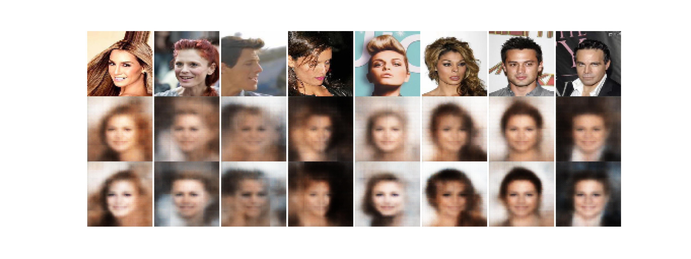
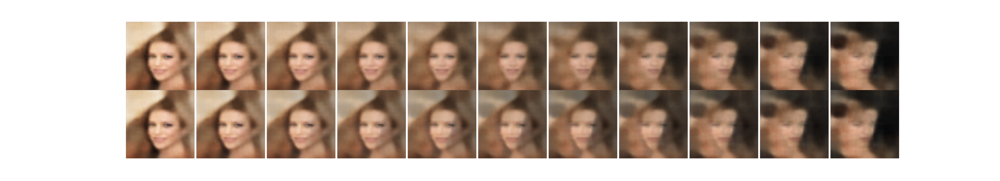
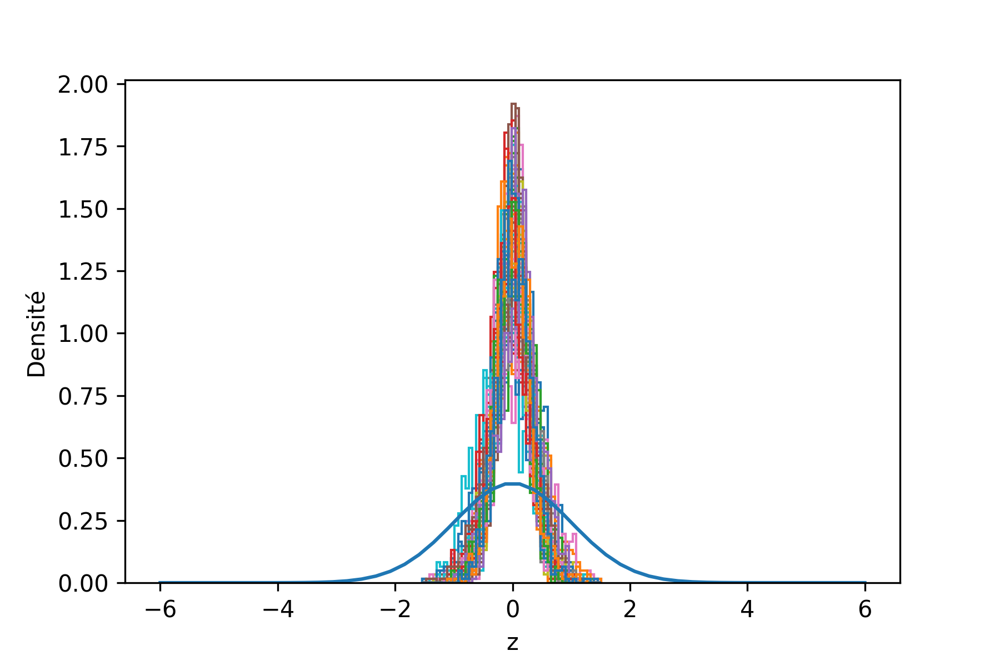

# Generating Faces

Nous avons traité les images avec skimage en appliquant un bruit $Uniform(0,1)$
et une normalisation sur 256.

Nous remarquons un léger biais vers les valeurs de saturation des canaux
\ref{figure:1}, ce qui est expliqué par des régions particulièrement sombres et
claires des images.

# Model

Nous avons implanté l'auto-encodeur variationel.

Pour reconstruire des images de bonne qualité, nous nous sommes inspirés de
l'architecture utilisée par Deep Feature Consistent Variational Autoencoder [@http://zotero.org/users/3733213/items/H5F7HPGA].
En particulier, nous avons utilisé une activation sigmoïde pour reconstruire le
spectre RGB du générateur normalisé sur l'intervalle $[0, 1]$, de la
normalisation par lot et des activations LeakyReLU.

Couche  Détails
------  -------
conv2d  32 kernel $4 \times 4$ strides 2
conv2d  64 kernel $4 \times 4$ strides 2
conv2d  128 kernel $4 \times 4$ strides 2
conv2d  256 kernel $4 \times 4$ strides 2
flatten 4096 unités

: Architecture de l'encodeur \label{table:1}

Toutes les convolution de la table \ref{table:1} utilisent la normalisation par
lot et une activation LeakyReLU.

Le décodeur possède l'architecture générale suivante:

Couche     Détails
------     -------
dense      4096 unités
reshape    $4096 \rightarrow 256 \times 4 \times 4$
upsampling dépend de l'implémentation
conv2d     128 kernel $3 \times 3$
upsampling dépend de l'implémentation
conv2d     64 kernel $3 \times 3$
upsampling dépend de l'implémentation
conv2d     32 kernel $3 \times 3$
upsampling dépend de l'implémentation
conv2d     3 kernel $3 \times 3$ avec activation sigmoïde

: Architecture du décodeur

Toutes les convolutions du décodeur, à l'exception de la dernière, utilise la
normalisation par lot et une activation LeakyReLU.

L'upsampling utilisé dépend du type de décodeur:

 - déconvolution striée avec kernel $3 \times 3$ strides 2
 - interpolation du plus-proche-voisin avec facteur 2
 - interpolation bilinéaire avec facteur 2

Les implémentations pour les interpolations[^resize_nearest][^resize_bilinear]
sont fournies nativement par Tensorflow[@].

[^resize_nearest]: https://www.tensorflow.org/api_docs/python/tf/image/resize_nearest
[^resize_bilinear]: https://www.tensorflow.org/api_docs/python/tf/image/resize_bilinear

Nous avons remarqué un gain majeur de l'utilisation de la normalisation par lot
autant au niveau de l'encodeur et du décodeur.

Pour la déviation standard du postérieur $q(z \mid x; \mu, \sigma)$, la sortie
de l'encodeur correspond à son logarithme. Cela permet de s'assurer que la
déviation standard est positive, et d'assurer un a priori uniforme sur le
logarithme (a priori de Jeffrey pour un paramètre d'échelle). Ainsi:

\begin{align}
\log \sigma(z) = W_\sigma h + b,\\
\mu(z) = W_\mu h + b.
\end{align}

## 3. Comparaison des architectures

Les trois modèles ont été entraînés sur 1000 exemplaires de l'ensemble
d'entraînement pour juger de la qualité des reconstructions.

On remarque que la déconvolution striée (voir figure \ref{figure:2}) donne les
meilleurs résultats. L'interpolation bilinéaire a un effet de *smoothing* bien
marqué, mais aucune des deux approches ne permet de reconstruire les détails
fins.

On note que la pénalisation Kullback-Leibler est bien appliqué dans la figure
\ref{figure:3}. La divergence par rapport à la normale est dû au petit nombre
d'époques d'entraînement.

Le modèle XXX a été conservé pour l'évaluation des images générées.

## 4. Variantes

Nous avons implanté le *Importance Weighted Autoencoder*.

## 5. Évaluation qualitative

### (a) Échantillons visuels

L'IWAE reconstruit beaucoup mieux les images que le VAE classique. On remarque
en particulier que les détails fins comme les cheveux sont mieux reportés dans
les exemplaires reconstruits.

Nous avons également remarqué que même si il est plus coûteux à entraîner
(environ 2 fois plus de temps par exemplaire), sa perte converge beaucoup plus
rapidement.

Pourquoi? Plus $k$ (importance samples #) est grand, plus le variational gap
est petit. Aussi, la variance de l'estimation de la ELBO diminue avec $k$. Une
grande valeur de $k$ facilite la convergence.

### (b) Taille de l'espace latent

Les changements de taille de l'espace latent influencent-ils beaucoup le
modèle?

Augmenter la taille de l'espace latent peut être utile si le modèle possède une capacité suffisante.

### (c) Interpolation dans l'espace latent

Interpolation dans $z$ vs interpolation dans $x$.

Les échantillons interpolés dans $z$ donnent des images plus réalistes que les échantillons interpolés dans $x$. En effet, le support de $z$ correspond à un manifold dans l'espace de $x$, et le VAE cherche à faire correspondre à chaque point de l'espace latent un point possédant une probabilité non négligeable dans l'espace de $x$. Par contre, au sein de ce dernier, les images interpolées entre 2 points peuvent être très loin de la vraie distribution des $x$.

## 7. Évaluation quantitative (VAE)

K=2000

D = 64 x 64 x 3

$bpp = \frac{\log p(x)}{\log 2 \times D}$
